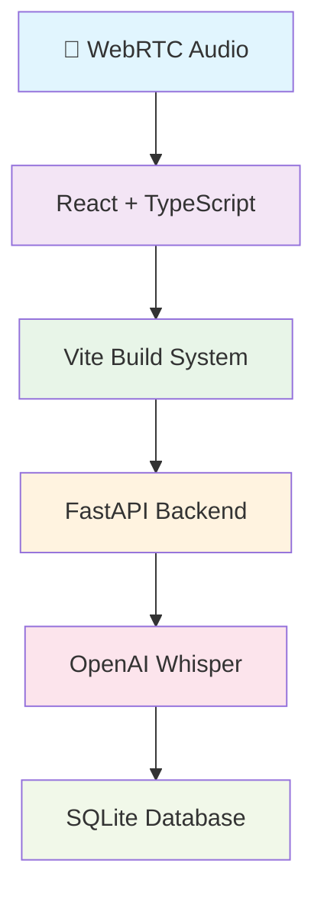

# 🎙️ Verba Audio Transcription System

<div align="center">

**🚀 Enhanced AI-powered audio transcription with real-time microphone recording**

[](https://github.com/marc-254/Verba.devops)
[](https://www.typescriptlang.org/)
[](https://reactjs.org/)
[](https://vitejs.dev/)
[](https://python.org/)
[](https://fastapi.tiangolo.com/)

*Open-source • Offline-capable • Production-ready*

[🚀 Quick Start](#-quick-start) • [✨ Features](#-features) • [📖 Documentation](#-documentation) • [🤝 Contributing](#-contributing)

</div>

---

## 🌟 Overview

**Verba** is a cutting-edge audio transcription system that combines the power of OpenAI Whisper with modern web technologies. Designed for **students**, **professionals**, and **content creators**, it offers real-time microphone recording, intelligent content detection, and specialized processing for music and rap transcription.

> **🎯 Perfect for:** Meeting notes • Lecture transcription • Music lyrics • Podcast processing • Voice memos

### 🎭 What Makes Verba Special?

- **🎤 Real-time Recording** - Browser-based microphone capture with visual feedback
- **🧠 Smart AI Processing** - Whisper "base" model with context-aware prompting  
- **🎵 Music Optimized** - Specialized handling for rap, hip-hop, and musical content
- **🌐 Offline First** - No internet required, privacy-focused
- **⚡ Modern Stack** - React + TypeScript + Vite + FastAPI

---

## ✨ Features

<table>
<tr>
<td width="50%">

### 🎤 **Real-Time Audio**
- **Live microphone capture** via WebRTC
- **Visual audio levels** with recording timer
- **Automatic processing** when recording stops
- **Cross-browser support** (Chrome, Firefox, Safari)

</td>
<td width="50%">

### 🚀 **Enhanced AI Transcription** 
- **OpenAI Whisper "base"** model (upgraded accuracy)
- **Smart content detection** (Speech vs Music)
- **Context-aware prompting** for specialized content
- **90+ languages** supported natively

</td>
</tr>
<tr>
<td>

### 💎 **Modern Interface**
- **Glassmorphism UI** with beautiful gradients
- **Responsive design** across all devices
- **Mode switching** (microphone vs file upload)
- **Enhanced history** with metadata badges

</td>
<td>

### 📊 **Advanced Backend**
- **FastAPI** with automatic documentation
- **SQLite** with connection pooling
- **Processing metrics** tracking
- **Content classification** system

</td>
</tr>
</table>

---

## 🚀 Quick Start

### 📋 Prerequisites

```bash
Node.js 16+    # Frontend development
Python 3.8+    # Backend processing  
4GB+ RAM       # For Whisper base model
```

### ⚡ Installation

**1️⃣ Clone Repository**
```bash
git clone https://github.com/marc-254/Verba.devops.git
cd Verba.devops
```

**2️⃣ Backend Setup**
```bash
cd backend
pip install -r requirements.txt

# Start backend server
uvicorn main:app --host 0.0.0.0 --port 8000
```

**3️⃣ Frontend Setup**
```bash
cd verba-frontend-ts
npm install

# Start development server
npm run dev
```

**4️⃣ Launch Application**
```bash
# 🌐 Frontend: http://localhost:5173
# 📋 API Docs: http://localhost:8000/docs
# ✅ Health Check: http://localhost:8000/health
```

### 🎯 First Steps

<table>
<tr>
<th>🎤 Microphone Mode</th>
<th>📁 File Upload Mode</th>
</tr>
<tr>
<td>
<ol>
<li>Click <strong>"🎤 Microphone"</strong> tab</li>
<li>Allow browser permissions</li>
<li>Hit <strong>"Start Recording"</strong></li>
<li>Speak clearly for 5-30 seconds</li>
<li>Click <strong>"Stop Recording"</strong></li>
<li>Watch AI transcription magic! ✨</li>
</ol>
</td>
<td>
<ol>
<li>Switch to <strong>"📁 Upload File"</strong></li>
<li>Select audio (MP3/WAV/M4A)</li>
<li>Monitor processing progress</li>
<li>Review content type detection</li>
<li>Check transcription accuracy</li>
<li>View enhanced metadata 📊</li>
</ol>
</td>
</tr>
</table>

---

## 🏗️ Architecture

### 🛠️ Technology Stack



### 📁 Project Structure

```
verba-audio-transcription/
├── 🎯 backend/
│   ├── main.py                    # 🚀 Enhanced FastAPI server
│   ├── requirements.txt           # 📦 Python dependencies
│   └── verba_app.db              # 🗄️ SQLite database
│
├── 💻 verba-frontend-ts/
│   ├── src/
│   │   ├── components/
│   │   │   ├── MicrophoneRecorder.tsx      # 🎤 Real-time recording
│   │   │   ├── AudioUploader.tsx           # 📁 File upload
│   │   │   ├── TranscriptionDisplay.tsx    # 📝 Results display
│   │   │   └── TranscriptionHistory.tsx    # 📚 History + metadata
│   │   │
│   │   ├── services/api.ts                 # 🔌 API integration
│   │   ├── types/api.ts                    # 📝 TypeScript interfaces
│   │   └── App.tsx                         # 🎯 Main application
│   │
│   ├── package.json
│   └── vite.config.ts
│
└── 📖 docs/
    └── API_REFERENCE.md
```

---

## 🔧 API Reference

### 🏥 Health Check
```http
GET /health
```
**Response:**
```json
{
  "status": "healthy",
  "model": "loaded", 
  "model_size": "base",
  "enhanced_features": true,
  "librosa_available": true
}
```

### 🎵 Transcribe Audio
```http
POST /transcribe
Content-Type: multipart/form-data

audio: <audio_file>
```
**Features:**
- ✅ Smart content detection (Music vs Speech)
- ✅ Context-aware processing for rap/hip-hop
- ✅ Enhanced metadata extraction
- ✅ Processing time tracking

### 📚 Get Transcription History  
```http
GET /transcriptions?session_id=default
```
**Returns:** Array with enhanced metadata including content type, processing metrics, and model version.

---

## 🐛 Troubleshooting

<details>
<summary><strong>🚨 Common Issues & Solutions</strong></summary>

### Issue: 422 Unprocessable Content Error
**Root Cause:** Missing `session_id` parameter in API calls

**✅ Solution:**
```typescript
// Update services/api.ts
const response = await fetch(`${API_BASE_URL}/transcriptions?session_id=default`);
```

### Issue: Microphone Not Working
**Possible Causes:** Browser permissions, HTTPS requirement

**✅ Solutions:**
- Allow microphone access in browser settings
- Use HTTPS in production (HTTP works on localhost)
- Check browser compatibility: Chrome 53+, Firefox 36+, Safari 11+

### Issue: Vite Build Errors
**Common TypeScript/React Issues:**

```bash
# Clear cache and reinstall
rm -rf node_modules package-lock.json
npm install

# Force Vite rebuild
npm run dev -- --force

# Update TypeScript
npm install typescript@latest
```

### Issue: Python Dependencies 
**Whisper Installation Problems:**

```bash
# For Apple Silicon Macs
pip install torch torchaudio

# For CUDA support  
pip install torch torchaudio --index-url https://download.pytorch.org/whl/cu118

# Alternative Whisper install
pip install openai-whisper --upgrade
```

</details>

---

## 📊 Performance & Specifications

### 🎯 Model Performance
- **Processing Speed:** ~2-3x real-time
- **Model Size:** Whisper Base (~140MB, 39M parameters)  
- **Accuracy:** Significant improvement over tiny model
- **Memory Usage:** ~1GB RAM recommended
- **Languages:** 90+ supported natively

### 💻 System Requirements
| Component | Minimum | Recommended |
|-----------|---------|-------------|
| **RAM** | 4GB | 8GB |
| **Storage** | 2GB free | 5GB free |
| **OS** | Windows 10, macOS 10.15, Ubuntu 18.04 | Latest versions |
| **Browser** | Chrome 53+, Firefox 36+, Safari 11+ | Latest Chrome |

### ⚡ Optimization Tips
- Use **base model** for best accuracy/speed balance
- Enable **voice activity detection** for long recordings
- Consider **chunking audio** files over 10 minutes
- Monitor **memory usage** during batch processing

---

## 🤝 Contributing

We welcome contributions from the community! Here's how to get involved:

### 🎯 Development Setup
```bash
# Backend development mode
cd backend
uvicorn main:app --reload

# Frontend development mode  
cd verba-frontend-ts
npm run dev -- --host
```

### 📋 Contribution Process
1. **🍴 Fork** the repository
2. **🌿 Create** a feature branch (`git checkout -b feature/amazing-feature`)
3. **💾 Commit** your changes (`git commit -m 'Add amazing feature'`)
4. **🚀 Push** to branch (`git push origin feature/amazing-feature`)  
5. **🎯 Open** a Pull Request

### 🎨 Areas We Need Help
- [ ] **Real-time streaming** transcription
- [ ] **Language detection** automation
- [ ] **Speaker diarization** features
- [ ] **Export functionality** (PDF, DOCX)
- [ ] **Mobile app** development
- [ ] **Documentation** improvements

---

## 📄 License & Credits

### 📋 License
This project is licensed under the **MIT License** - see the [LICENSE](LICENSE) file for full details.

### 🙏 Acknowledgments
- **[OpenAI Whisper](https://github.com/openai/whisper)** - Robust speech recognition model
- **[FastAPI](https://fastapi.tiangolo.com/)** - Modern Python web framework  
- **[Vite](https://vitejs.dev/)** - Next generation frontend tooling
- **[React](https://reactjs.org/)** - User interface library
- **Original Verba Project** - Foundation and inspiration

### 👨‍💻 Developed By
**Mark Munene** - *Full-stack Developer & AI Enthusiast*

---

## 📞 Support & Community

<div align="center">

### 💬 Get Help & Connect

[](https://github.com/marc-254/Verba.devops/issues)
[](https://github.com/marc-254/Verba.devops/discussions)  
[](./docs/)

**Found a bug?** Open an issue • **Need help?** Start a discussion • **Want to contribute?** Check our guidelines

---

### 🌟 Show Your Support

**If Verba helps you, please consider:**

⭐ **Star** this repository • 🐛 **Report** bugs • 💡 **Suggest** features • 🤝 **Contribute** code

**Built with ❤️ for seamless audio transcription**

*Last updated: August 28, 2025*

</div>
