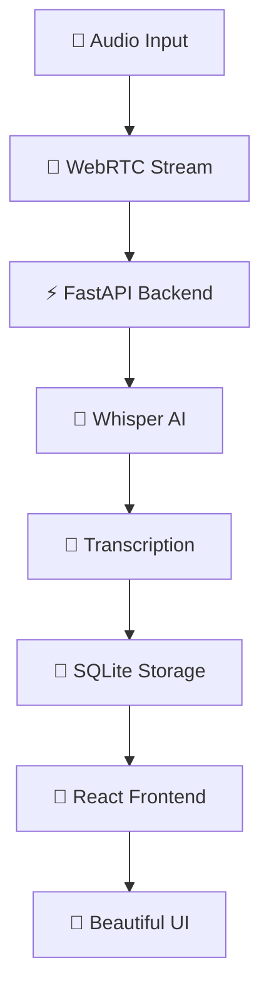
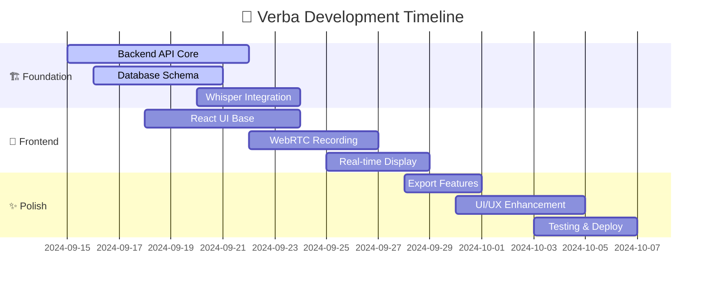

# 🚀 Verba
### *The Future of Real-Time Audio Transcription* ✨

<div align="center">


[](https://opensource.org/licenses/MIT)
[](https://www.python.org/downloads/)
[](https://reactjs.org/)
[](https://fastapi.tiangolo.com/)
[](https://openai.com/blog/whisper/)

**🌟 Privacy-First • Lightning-Fast • AI-Powered • Open Source 🌟**

*Transform speech into text in real-time with cutting-edge AI*

</div>

---

## 🎯 **Why Verba?**

<table>
<tr>
<td width="50%">

### 🔥 **What Makes It Special**
🛡️ **100% Privacy-First** - All processing happens locally  
⚡ **Real-Time Magic** - See words appear as you speak  
🤖 **OpenAI Whisper Powered** - Industry-leading accuracy  
🎨 **Stunning UI** - Modern glassmorphism design  
🌍 **90+ Languages** - Transcribe in any language  
📱 **Cross-Platform** - Desktop, mobile, anywhere  

</td>
<td width="50%">

### 🚀 **Perfect For**
🎓 **Students** - Record lectures, meetings, interviews  
💼 **Professionals** - Meeting notes, voice memos  
🎬 **Content Creators** - Video subtitles, podcasts  
♿ **Accessibility** - Voice-to-text for everyone  
🔬 **Researchers** - Interview transcriptions  
📝 **Writers** - Voice-to-draft your ideas  

</td>
</tr>
</table>

---

## 🛠️ **Cutting-Edge Tech Stack**

<div align="center">

| **Backend Powerhouse** | **Frontend Excellence** | **AI & Processing** |
|:---:|:---:|:---:|
|  |  |  |
|  |  |  |
|  |  |  |

</div>

---

## ⚡ **Quick Start Guide**

<div align="center">

### 🎬 **Get Running in 3 Steps!**

</div>

```bash
# 🔥 Step 1: Clone the magic
git clone https://github.com/marc-254/Verba.devops.git
cd Verba.devops

# 🚀 Step 2: Backend power-up
cd backend && python -m venv venv
source venv/bin/activate  # Windows: venv\Scripts\activate
pip install -r requirements.txt

# ⚡ Step 3: Frontend lightning
cd ../frontend && npm install && npm run dev
```

<div align="center">

**🎉 That's it! Visit `http://localhost:5173` and start transcribing! 🎉**

</div>

---

## 🌟 **Features That'll Blow Your Mind**

<table>
<tr>
<td width="33%">

### 🎙️ **Audio Magic**
- ✨ Real-time transcription
- 🎵 Multiple format support
- 🔊 Audio visualization
- 🎯 Noise reduction
- 📊 Quality indicators

</td>
<td width="33%">

### 🤖 **AI Superpowers**
- 🧠 OpenAI Whisper integration
- 🌍 90+ language detection
- 🎯 Confidence scoring
- ⚡ Multiple model options
- 🔄 Continuous learning

</td>
<td width="33%">

### 💎 **User Experience**
- 🎨 Glassmorphism design
- 📱 Responsive interface
- ⌨️ Keyboard shortcuts
- 🌙 Dark/Light themes
- 💾 Auto-save magic

</td>
</tr>
</table>

---

## 🏗️ **Project Architecture**

<div align="center">



</div>

### 📁 **Crystal Clear Structure**

```
🏠 verba/
├── 🚀 backend/           # FastAPI powerhouse
│   ├── 🎯 main.py        # Server magic starts here
│   ├── 🗃️ models/        # Database schemas
│   ├── 🛣️ routes/        # API endpoints
│   ├── ⚙️ services/      # Whisper AI integration
│   └── 📋 requirements.txt
├── 💎 frontend/          # React brilliance
│   ├── 🎨 src/
│   │   ├── 🧩 components/  # Reusable UI magic
│   │   ├── 📄 pages/      # Main app screens
│   │   ├── 🔗 services/   # API communication
│   │   └── 🎯 types/      # TypeScript definitions
│   ├── 📦 package.json
│   └── ⚡ vite.config.ts
└── 📚 docs/              # Everything you need to know
```

---

## 🎯 **API Endpoints**

<div align="center">

### 🌐 **RESTful API That Just Works**

</div>

| 🚀 Method | 🎯 Endpoint | 💡 What It Does | ✨ Magic |
|:---------:|:----------:|:---------------:|:--------:|
| `GET` | `/health` | 💚 Server heartbeat | Always alive |
| `POST` | `/transcribe` | 🎤 Transform audio → text | AI-powered |
| `GET` | `/history` | 📜 Your transcription story | Full history |
| `POST` | `/history` | 💾 Save your gems | Instant storage |
| `DELETE` | `/history/{id}` | 🗑️ Clean up | One-click delete |
| `GET` | `/export/{id}` | 📤 Download magic | Multiple formats |

### 🔌 **WebSocket Superpowers**
| 🎯 Endpoint | 💫 Real-Time Magic |
|:-----------:|:------------------:|
| `/ws/transcribe` | ⚡ Live transcription stream |

---

## 🎨 **Supported Formats & Languages**

<div align="center">

<table>
<tr>
<td width="50%">

### 🎵 **Audio Formats**
```
📀 Input Support:
🔊 WAV • MP3 • M4A • FLAC
⚡ Real-time: WebRTC streams
🎯 Optimal: 16kHz, 16-bit

🤖 AI Models:
⚡ Whisper Tiny  → Lightning fast
🎯 Whisper Base  → Balanced magic
🔥 Whisper Large → Ultimate accuracy
```

</td>
<td width="50%">

### 🌍 **Global Language Support**
```
🌐 90+ Languages Including:
🇺🇸 English     🇪🇸 Spanish     🇫🇷 French
🇩🇪 German      🇮🇹 Italian     🇵🇹 Portuguese  
🇷🇺 Russian     🇯🇵 Japanese    🇰🇷 Korean
🇨🇳 Chinese     🇦🇪 Arabic      🇮🇳 Hindi
🔄 Auto-detection magic built-in!
```

</td>
</tr>
</table>

</div>

---

## 💪 **System Requirements**

<table>
<tr>
<td width="50%">

### 🎯 **Minimum Specs**
```yaml
💾 RAM: 4GB
💿 Storage: 2GB free
⚡ CPU: Dual-core
🌐 Browser: Chrome 80+ | Firefox 75+ | Safari 13+
```

</td>
<td width="50%">

### 🚀 **Recommended Power**
```yaml
🔥 RAM: 8GB+
💿 Storage: 5GB free
⚡ CPU: Quad-core+
🎮 GPU: CUDA-compatible (optional boost!)
```

</td>
</tr>
</table>

---

## 🗺️ **Development Roadmap**

<div align="center">

### 🎯 **The Journey to Transcription Excellence**

</div>



### 🎯 **Feature Status**

<div align="center">

| Phase | Feature | Status | Timeline |
|:-----:|:-------:|:------:|:--------:|
| 🏗️ | **Core API** | 🔄 In Progress | Week 1 |
| 🤖 | **Whisper AI** | ⏳ Planned | Week 2 |
| 🎨 | **React UI** | 🔄 In Progress | Week 2 |
| ⚡ | **Real-time** | ⏳ Planned | Week 3 |
| 💎 | **Export** | ⏳ Planned | Week 4 |

</div>

---

## 🤝 **Join the Revolution**

<div align="center">

### 🌟 **We Need You!**

**Help us build the future of voice transcription!**

</div>

### 🎯 **How to Contribute**

```bash
# 🍴 Fork it
git clone https://github.com/YOUR-USERNAME/Verba.devops.git

# 🌱 Branch it  
git checkout -b feature/amazing-transcription-magic

# ✨ Code it
# ... your brilliant contributions ...

# 🚀 Push it
git push origin feature/amazing-transcription-magic

# 🎉 PR it - Open a Pull Request!
```

### 💡 **Contribution Ideas**

<table>
<tr>
<td width="33%">

**🎨 Frontend Magic**
- UI/UX improvements
- New themes & designs
- Mobile responsiveness
- Accessibility features

</td>
<td width="33%">

**⚡ Backend Power**
- API optimizations
- New endpoints
- Database improvements
- Performance tuning

</td>
<td width="33%">

**🤖 AI Enhancement**
- Model optimizations
- Language support
- Accuracy improvements
- Processing speed

</td>
</tr>
</table>

---

## 🏆 **Recognition Wall**

<div align="center">

### 🌟 **Hall of Fame** 🌟

*Coming soon - your name could be here!*

**Be the first to contribute and earn your place in Verba history!** 🚀

</div>

---

## 🐛 **Known Issues & Solutions**

<div align="center">

### 🔧 **We're Transparent About Everything**

</div>

| 🐛 Issue | 💡 Status | 🎯 Solution |
|:--------:|:---------:|:----------:|
| Repository URL verification | 🔄 Working | Testing clone process |
| Development environment | ⚡ Priority | Automated setup script |
| Dependency management | 🔄 Active | Version compatibility check |

---

## 📞 **Get Help & Support**

<div align="center">

### 💬 **We're Here for You!**

</div>

<table>
<tr>
<td width="50%">

### 🆘 **Need Help?**
1. 📚 **Check Documentation** - `docs/` folder
2. 🔍 **Search Issues** - GitHub Issues tab  
3. 💬 **Ask Questions** - Create new issue
4. 🐛 **Report Bugs** - Detailed bug reports

</td>
<td width="50%">

### 🎯 **Quick Links**
- 📖 [Documentation](docs/)
- 🐛 [Report Issues](../../issues)
- 💡 [Feature Requests](../../issues)
- 🤝 [Contributing Guide](CONTRIBUTING.md)

</td>
</tr>
</table>

---

## 📄 **License**

<div align="center">

### 📜 **MIT License - Freedom to Innovate**

This project is licensed under the MIT License - see the [LICENSE](LICENSE) file for details.

**🎉 Free to use, modify, and distribute! 🎉**

</div>

---

<div align="center">

## 🌟 **Star the Repo • Share the Love • Build the Future** 🌟

[](https://github.com/marc-254/Verba.devops/stargazers)
[](https://github.com/marc-254/Verba.devops/network)
[](https://github.com/marc-254/Verba.devops/watchers)

---

### 💝 **Built with ❤️ for Developers by Developers**

*Transforming the way we interact with audio, one transcription at a time*

**🚀 Ready to revolutionize transcription? Let's build something amazing together! 🚀**

---

*Made with 🔥 passion and ⚡ cutting-edge technology*

</div>
